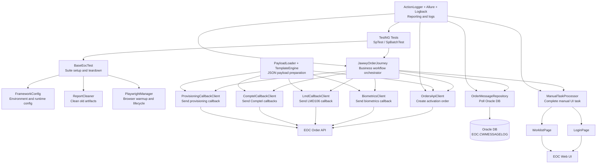
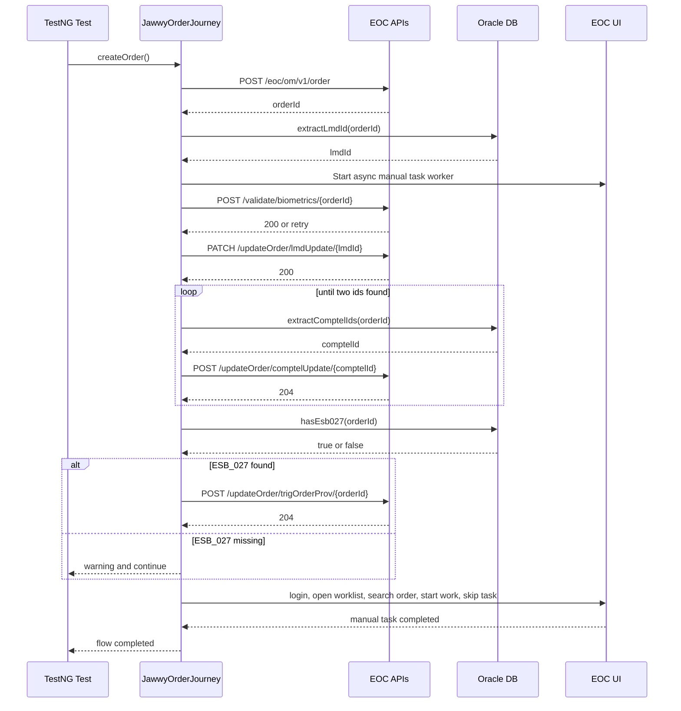

# Jawwy Automation Architecture Diagram

This file gives a visual view of how the project is structured and how the SP activation flow moves through the framework.

## High-Level Architecture



## SP Activation Flow



## Layer View

```text
Tests
  SpTest
  SpBatchTest

Workflow Layer
  JawwyOrderJourney

Integration Layers
  API: OrdersApiClient, BiometricsClient, LmdCallbackClient, ComptelCallbackClient, ProvisioningCallbackClient
  DB:  OrderMessageRepository
  UI:  ManualTaskProcessor, LoginPage, WorklistPage, PlaywrightManager

Support Layers
  Config: FrameworkConfig
  Payloads: PayloadLoader, TemplateEngine, JSON files under src/main/resources/payloads
  Reporting: ActionLogger, ReportCleaner, Allure, Logback

Execution / Delivery
  Maven
  TestNG / Surefire
  Jenkins
  GitHub Actions
```

## Main Files To Open

1. `src/main/java/com/jawwy/automation/workflow/JawwyOrderJourney.java`
2. `src/test/java/com/jawwy/automation/tests/orders/SpTest.java`
3. `src/test/java/com/jawwy/automation/tests/orders/SpBatchTest.java`
4. `src/main/java/com/jawwy/automation/db/OrderMessageRepository.java`
5. `src/main/java/com/jawwy/automation/ui/ManualTaskProcessor.java`
